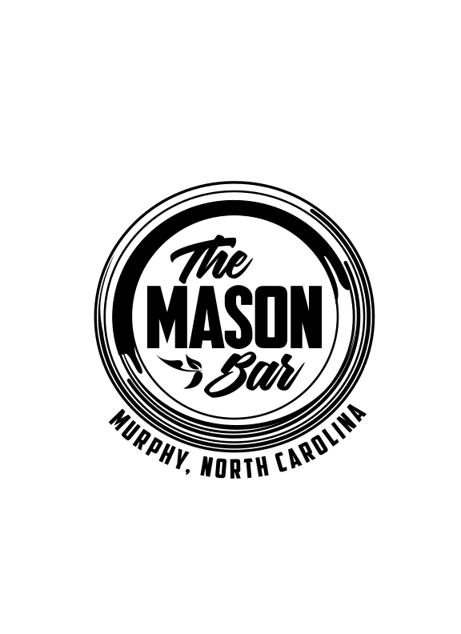

<!-- PROJECT LOGO -->
 

    
  </a>
  <h3 align="center">Mason Bar Website</h3>
  

     
  

<!-- ABOUT THE PROJECT -->
## About The Project

I reached out to a local establishment I noticed didn't have a website, really nice people, and asked if they would be okay with me making them a website.  They obliged so I got to it.  My vision was for them to have a not just a website but an admin tool which would allow them to modify their content to boost the user experience.  Beyond that they have live music daily so I knew I wanted to incorporate an interactive calendar as a major feature.  They also change their menu somewhat frequently so I wanted them to have control over that digitally as well.  All things considered I'm keeping it fairly streamline and highlighting what makes their establishment what it is.  Thank you for looking!

(<a href="#top">back to top</a>)

### Built With

 

(<a href="#top">back to top</a>)

